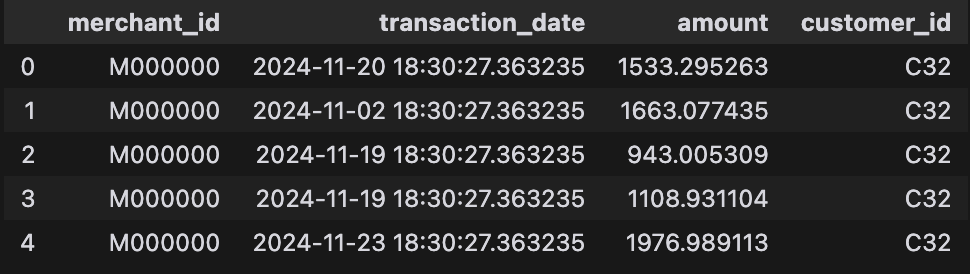
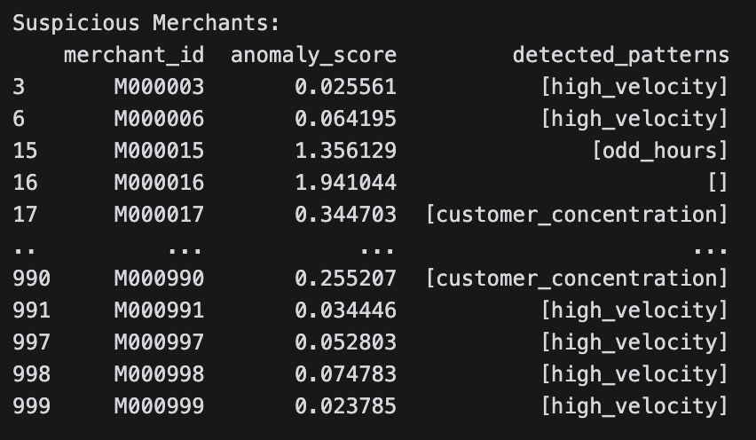
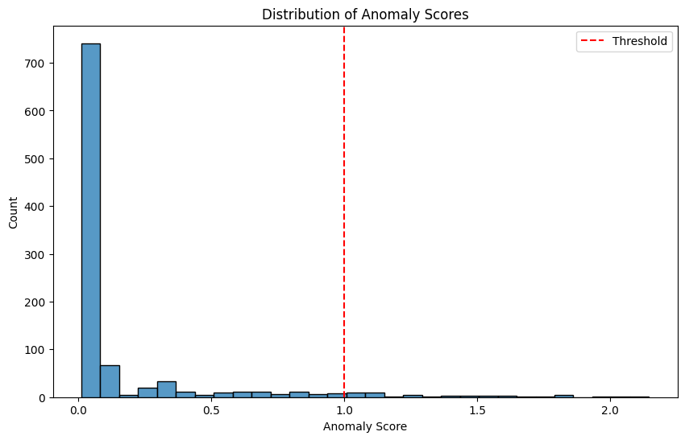

# Merchant and Transaction Data Generation Framework

This project provides tools for generating synthetic merchant profiles and transaction data with embedded fraudulent patterns. It includes feature engineering for analytics and model development for fraud detection.

---

## **Data Generation**

### **1. Merchant Profile Generator**
- Creates merchant profiles with both basic and additional fields.

### **2. Transaction Generator**
- Generates both normal and fraudulent transaction patterns.

---

## **Key Characteristics of the Generated Data**

### **Merchant Profiles**
- **Unique merchant IDs**: Each merchant is assigned a unique identifier.
- **Business Types**: Merchants belong to different business categories (e.g., Retail, E-commerce).
- **Registration Dates**: Randomly assigned registration dates within a given range.
- **GST Statuses**: Merchants have different GST statuses (Active, Inactive, Pending).
- **Fraudulent Flag**: 20% of the merchants are marked as fraudulent.
=======

---

### **Normal Transactions**
- **Volume**: Generates 50–200 transactions per merchant.
- **Dates**: Transaction dates are random within a specified period.
- **Amounts**: Follow a normal distribution (mean: 1000, std dev: 300).
- **Customer IDs**: Randomly assigned to each transaction.

---

### **Fraudulent Patterns**

#### **a. Late Night Pattern**
- **Volume**: Generates 20–50 transactions during unusual hours (11 PM–4 AM).
- **Amounts**: Higher average transaction amount (mean: 2000, std dev: 500).

#### **b. High Velocity Pattern**
- **Spike Day**: Picks a single "spike day" and generates 100–200 transactions.
- **Distribution**: Spreads transactions across the 24 hours.
- **Amounts**: Higher average transaction amount (mean: 1500, std dev: 400).

#### **c. Customer Concentration Pattern**
- **Dominance**: Assigns 80% of transactions to a single customer ID.
- **Volume**: Generates 50–150 transactions.
- **Amounts**: Normally distributed (mean: 1200, std dev: 300).

---
### **Example Data**
An example image of the generated data structure:


--- 

## **Feature Engineering**

### **Function: `calculate_merchant_features`**

Generates a feature set for each merchant based on their transactions. Aggregates transaction data to compute metrics such as transaction velocity, amount distribution, time-based patterns, and customer concentration.

### **Output**
The function produces a DataFrame where each row represents a merchant, with aggregated features derived from their transaction data:

| **Feature Name**         | **Description**                                                                 |
|---------------------------|---------------------------------------------------------------------------------|
| `merchant_id`             | Unique identifier for the merchant.                                            |
| `avg_daily_txns`          | Average number of transactions per day for the merchant.                       |
| `max_daily_txns`          | Maximum transactions in a single day.                                          |
| `min_daily_txns`          | Minimum transactions in a single day.                                          |
| `std_daily_txns`          | Standard deviation of daily transaction counts.                                |
| `night_txn_ratio`         | Proportion of transactions occurring during night hours (10 PM–4 AM).          |
| `avg_amount`              | Average transaction amount.                                                    |
| `std_amount`              | Standard deviation of transaction amounts.                                     |
| `min_amount`              | Minimum transaction amount.                                                    |
| `max_amount`              | Maximum transaction amount.                                                    |
| `customer_concentration`  | Proportion of transactions from the most frequent customer relative to the total.|

---

### **How It Works**
1. **Transaction Velocity Metrics**:
   - Computes the average, maximum, minimum, and standard deviation of daily transaction counts.

2. **Time-Based Patterns**:
   - Analyzes the hourly distribution of transactions.
   - Calculates the proportion of transactions occurring during night hours (10 PM–4 AM).

3. **Amount Distributions**:
   - Extracts statistics such as mean, standard deviation, minimum, and maximum for transaction amounts.

4. **Customer Concentration**:
   - Determines the dominance of a single customer by calculating the proportion of transactions from the most frequent customer.

---

## **Model Development**

### **FraudDetectionAutoencoder**

This autoencoder model is designed for detecting fraudulent patterns by learning to reconstruct input feature vectors. High reconstruction errors indicate anomalies, which could point to fraud.

---

## **Model Architecture**

- **Input Layer**: Takes the normalized feature vector as input.
- **Encoder**: 
  - **Dense Layer 1**: 32 neurons, ReLU activation.
  - **Dense Layer 2**: 16 neurons, ReLU activation.
  - **Dense Layer 3**: 8 neurons, ReLU activation.
- **Decoder**: 
  - **Dense Layer 1**: 16 neurons, ReLU activation.
  - **Dense Layer 2**: 32 neurons, ReLU activation.
  - **Output Layer**: Same size as input, Sigmoid activation for reconstruction.

---

## **Training**

- **Optimizer**: Adam
- **Loss Function**: Mean Squared Error (MSE)
- **Epochs**: 200
- **Batch Size**: 32
- **Validation Split**: 10%


---

## **Anomaly Detection with Autoencoder**

1. **Reconstruction**:
   - The autoencoder predicts the reconstructed feature values:
     ```python
     reconstructed = autoencoder.predict(normalized_features)
     ```

2. **MSE Calculation**:
   - Compute the Mean Squared Error (MSE) between the original and reconstructed features:
     ```python
     mse = np.mean(np.power(normalized_features - reconstructed, 2), axis=1)
     ```

3. **Threshold**:
   - Set an anomaly threshold at the 95th percentile of MSE:
     ```python
     threshold = np.percentile(mse, 95)
     ```

4. **Anomaly Scores**:
   - Normalize the MSE values by the threshold to get anomaly scores:
     ```python
     anomaly_scores = mse / threshold
     ```

   Anomaly scores above 1 indicate potential fraud.


## **Fraud Pattern Detection**

The `detect_patterns` function identifies suspicious merchant activity based on three patterns:

1. **High Velocity**: If the difference between max and average daily transactions is significantly above the standard deviation, it's flagged as **high velocity**.
   
2. **Odd-Hours**: If more than 30% of transactions occur during night hours (10 PM - 4 AM), it's flagged as **odd hours**.

3. **Customer Concentration**: If a single customer accounts for more than 50% of transactions, it's flagged for **customer concentration**.

Merchants are considered **suspicious** if:
- Their anomaly score is above 1.0.
- They exhibit any of the above patterns.


---

## **Displaying Suspicious Merchants & Anomaly Score Distribution**

The following code identifies suspicious merchants based on the calculated anomaly scores and detected patterns, then visualizes the distribution of these scores.

### **Steps**

1. **Display Suspicious Merchants**:
   - The suspicious merchants are filtered based on their anomaly score and detected fraud patterns. The merchants with an anomaly score greater than 1.0 or exhibiting any of the fraud patterns (high velocity, odd hours, or customer concentration) are flagged as suspicious:
   


2. **Plot Anomaly Score Distribution**:


### **Outcome**
- The table of suspicious merchants shows their IDs, anomaly scores, and the fraud patterns detected for each merchant.
- The plot illustrates how anomaly scores are distributed, with the threshold for suspicious activity clearly marked.

---

## **Detection Metrics**

1. **Precision**: 0.70 – 70% of flagged suspicious merchants are truly fraudulent.
2. **Recall**: 0.83 – 83% of actual fraudulent merchants are detected.
3. **F1 Score**: 0.76 – A balanced performance between precision and recall.

These metrics indicate a solid fraud detection system with effective fraud identification and minimal false positives.


